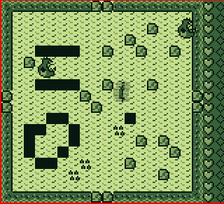

# Pineapple of Doom

_Abandon all hope, ye who enter here..._

This is an end-of-first-year project, completed in just **two weeks** from start
to finish by students from the Télécom Paris digital engineering school.

In that time, we learned how to develop games for the original Game Boy, and did
our best to make a little game before the relentless march of time was done
bringing us to the deadline. This is the result of our efforts, a game about a
chainsaw-wielding, mentally troubled pineapple. Some shortcuts had to be taken
along the way... but hey, it works!

We obviously didn't have time to make a _complete_ game, but if you want to
**try out our demo**, you may [download a
release](https://github.com/PainsPerdus/gboi-kirby/releases) and run it under an
original Game Boy emulator such as [SameBoy](https://sameboy.github.io/).

We were asked to keep a **journal** of our struggles, discoveries, etc, and we put
it online! You can read it [here](https://painsperdus.github.io/gboi-kirby/) if
game development, GBZ80 assembly and obscure compiler bugs are your thing.

Yours truly, the members of _Team Kirby_,

- Adame Ben Friha ([@AdameBf](https://github.com/AdameBf))
- Erwann Roussy ([@RoussyE](https://github.com/RoussyE))
- Nolwenn Jouan ([@Ametheek](https://github.com/Ametheek))
- Paul Vezia ([@PaulVez](https://github.com/PaulVez))
- Tony Law ([@ChatPion](https://github.com/ChatPion))
- Yohaï-Eliel Berreby ([@yberreby](https://github.com/yberreby/))
